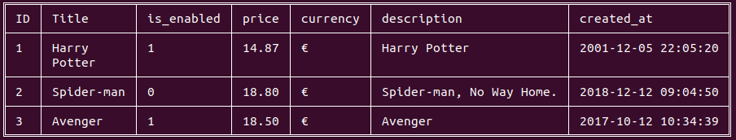
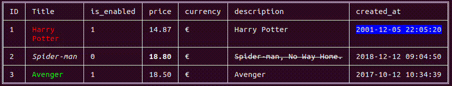

[](https://github.com/disco07/rct/actions/workflows/rust.yml)
[](https://crates.io/crates/rct)
[](https://docs.rs/rct/)
[](https://codecov.io/gh/disco07/rct)
# rct
A CLI Table Output for Rust 🦀 projects.




## Installation
Add from command line.
```
cargo install rct
```
Or add this to your Cargo.toml file.
```
[dependencies]
rct = "0.2.0"

# Or add from github main branch.
rct = { git = "https://github.com/disco07/rct.git", branch = "main" }

```

## Usage
### Basic usage
```rust
fn main() {
    use rct::cell::ICell;
    use rct::table::Table;

    let mut table = Table::new();

    table
        .add_header(vec![
            "ID".cell(),
            "Title".cell(),
            "is_enabled".cell(),
            "price".cell(),
            "currency".cell(),
            "description".cell(),
            "created_at".cell(),
        ])
        .add_row(vec![
            1.cell(),
            "Harry \nPotter".cell(),
            "1".cell(),
            "14.87".cell(),
            "€".cell(),
            "Harry Potter".cell(),
            "2001-12-05 22:05:20".cell(),
        ])
        .add_row(vec![
            2.cell(),
            "Spider-man".cell(),
            "0".cell(),
            "18.80".cell(),
            "€".cell(),
            "Spider-man, No Way Home.".cell(),
            "2018-12-12 09:04:50".cell(),
        ])
        .add_row(vec![
            3.cell(),
            "Avenger".cell(),
            "1".cell(),
            "18.50".cell(),
            "€".cell(),
            "Avenger".cell(),
            "2017-10-12 10:34:39".cell(),
        ]);

    table.view()
}
```

### Customizing the table (add colors)
```rust
use rct::cell::ICell;
use rct::styles::color::{Colorizer, Font};
use rct::table::Table;

fn main() {
    let mut table = Table::new();

    table
        .add_header(vec![
            "ID".cell(),
            "Title".cell(),
            "is_enabled".cell(),
            "price".cell(),
            "currency".cell(),
            "description".cell(),
            "created_at".cell(),
        ])
        .add_row(vec![
            1.cell(),
            "Harry \nPotter".cell().color("#ff0000"),
            "1".cell(),
            "14.87".cell(),
            "€".cell(),
            "Harry Potter".cell(),
            "2001-12-05 22:05:20"
                .cell()
                .bg("#0000ff")
                .font(Font::Blinking),
        ])
        .add_row(vec![
            2.cell(),
            "Spider-man".cell().font(Font::Italic),
            "0".cell(),
            "18.80".cell().font(Font::Bold),
            "€".cell(),
            "Spider-man, No Way Home.".cell().font(Font::Strikethrough),
            "2018-12-12 09:04:50".cell(),
        ])
        .add_row(vec![
            3.cell(),
            "Avenger".cell().color("#00ff00"),
            "1".cell(),
            "18.50".cell(),
            "€".cell(),
            "Avenger".cell(),
            "2017-10-12 10:34:39".cell(),
        ]);

    table.view();
}

```

### Derive macro

#[derive(ToTable)] can also be used to print a Vec or slice of structs as table.
```rust
use rct::styles::color::{Colorizer, Font};
use rct::ToTable;

#[derive(ToTable)]
struct Movies<T, S> {
    #[table(rename = "ID", color = "#00ff00")]
    id: T,
    #[table(rename = "Title", bg = "#ff0000")]
    title: S,
    #[table(rename = "Price €", font = "Font::Bold")]
    price: f32,
}

fn main() {
    let movies = [
        Movies {
            id: 1,
            title: "Harry \nPotter".to_string(),
            price: 14.87,
        },
        Movies {
            id: 2,
            title: "Spider-man".to_string(),
            price: 18.80,
        },
    ];

    let table = movies.into_iter().to_table();

    println!("{}", table);
}
```
#### Field attributes
<li>rename: Used to rename a column. Usage: #[table(rename = "Name")]</li>
<li>color: Used to specify color of contents of a column with hexadecimal value. Usage: #[table(color = "#00ff00")]</li>
<li>bg: Used to specify background color of contents of a column with hexadecimal value. Usage: #[table(bg = "#ff0000")]</li>
<li>font: Used to add style like bold, italic, ... to the column. Usage: #[table(font = "Font::Bold")]</li>


## Contributing 🤝
Contributions, issues, and feature requests are welcome!

Feel free to check the issues page.

## 📝 License
[](https://opensource.org/licenses/MIT)
