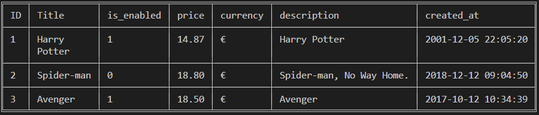
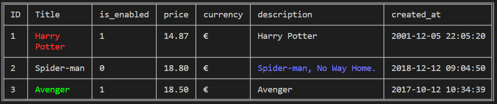

[](https://github.com/disco07/rct/actions/workflows/rust.yml)
[](https://crates.io/crates/rct)
[](https://docs.rs/rct/)
[](https://codecov.io/gh/disco07/rct)
# rct
A CLI Table Output for Rust 🦀 projects.

## Installation
Add from command line.
```
cargo install rct
```
Or add this to your Cargo.toml file.
```
[dependencies]
rct = "0.1.5"

# Or add from github main branch.
rct = { git = "https://github.com/disco07/rct.git", branch = "main" }

```

## Usage
### Basic usage
```rust
fn main() {
    use rct::cell::ICell;
    use rct::table::Table;

    let mut table = Table::new();

    table
        .add_header(vec![
            "ID".cell(),
            "Title".cell(),
            "is_enabled".cell(),
            "price".cell(),
            "currency".cell(),
            "description".cell(),
            "created_at".cell(),
        ])
        .add_row(vec![
            1.cell(),
            "Harry \nPotter".cell(),
            "1".cell(),
            "14.87".cell(),
            "€".cell(),
            "Harry Potter".cell(),
            "2001-12-05 22:05:20".cell(),
        ])
        .add_row(vec![
            2.cell(),
            "Spider-man".cell(),
            "0".cell(),
            "18.80".cell(),
            "€".cell(),
            "Spider-man, No Way Home.".cell(),
            "2018-12-12 09:04:50".cell(),
        ])
        .add_row(vec![
            3.cell(),
            "Avenger".cell(),
            "1".cell(),
            "18.50".cell(),
            "€".cell(),
            "Avenger".cell(),
            "2017-10-12 10:34:39".cell(),
        ]);

    table.view()
}
```


### Customizing the table (add colors)
```rust
use rct::cell::ICell;
use rct::color::Colorizer;
use rct::table::Table;

fn main() {
    let mut table = Table::new();

    table
        .add_header(vec![
            "ID".cell(),
            "Title".cell(),
            "is_enabled".cell(),
            "price".cell(),
            "currency".cell(),
            "description".cell(),
            "created_at".cell(),
        ])
        .add_row(vec![
            1.cell(),
            "Harry \nPotter".cell().color("#ff0000"),
            "1".cell(),
            "14.87".cell(),
            "€".cell(),
            "Harry Potter".cell(),
            "2001-12-05 22:05:20".cell(),
        ])
        .add_row(vec![
            2.cell(),
            "Spider-man".cell(),
            "0".cell(),
            "18.80".cell(),
            "€".cell(),
            "Spider-man, No Way Home.".cell().color("#0000ff"),
            "2018-12-12 09:04:50".cell(),
        ])
        .add_row(vec![
            3.cell(),
            "Avenger".cell().color("#00ff00"),
            "1".cell(),
            "18.50".cell(),
            "€".cell(),
            "Avenger".cell(),
            "2017-10-12 10:34:39".cell(),
        ]);

    table.view();
}
```


## Contributing 🤝
Contributions, issues, and feature requests are welcome!

Feel free to check the issues page.

## 📝 License
[](https://opensource.org/licenses/MIT)
